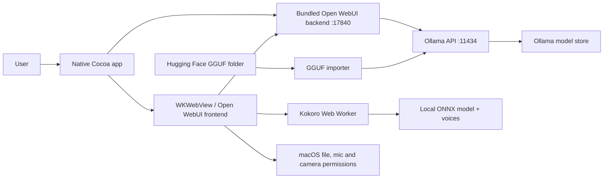

# Offline AI for macOS

An unofficial, personal-first macOS distribution of [Open WebUI](https://github.com/open-webui/open-webui) for running local AI models through Ollama. It packages the web interface, Python backend, and a native Cocoa/WebKit shell into an installable `.app` and `.dmg`.

> This project is an independent derivative of Open WebUI. It is not affiliated with or endorsed by the Open WebUI or Ollama teams. The upstream Open WebUI name and icon are retained to clearly credit the underlying project; see [Licensing](#licensing).

## What this fork adds

- A native Apple Silicon macOS application and DMG builder.
- Automatic startup and health checking of the bundled Open WebUI backend.
- Automatic connection to Ollama, including an optional managed `ollama serve` process.
- Immediate model preloading when a model is selected, with `Loading`, `Active`, and `Not loaded` UI states.
- Ollama capability discovery so tools are not sent to models that do not support them.
- Conservative runtime defaults: one loaded model, one parallel request, Flash Attention, a 4K context, and a short keep-alive to reduce memory and heat.
- Discovery/import of local Hugging Face GGUF files into Ollama.
- Native file selection, capture permissions, microphone permission handling, file uploads, and voice-call plumbing.
- Local Kokoro text-to-speech using ONNX/WASM and curated natural-sounding voices.
- The original Open WebUI interface, features, and local RAG stack.

## Architecture



### Frontend-to-backend connections

| Feature | Frontend/native entry | Backend/runtime connection |
| --- | --- | --- |
| App launch | `macos/OfflineAIApp.swift` | Starts `macos/start_backend.sh`, polls `/health`, then opens `http://127.0.0.1:17840` |
| Model list | Open WebUI model selector | Open WebUI backend proxies Ollama `/api/tags` |
| Model status | `ModelSelector.svelte` | Polls Ollama `/api/ps` through the authenticated backend route |
| Model preload | `Selector.svelte` | Sends an empty Ollama `/api/generate` request with `keep_alive` when selection changes |
| Chat | Open WebUI chat components | Backend middleware sends streaming `/api/chat` requests to Ollama |
| Tool support | Model selector and middleware | Queries Ollama `/api/show`; unsupported models are called without a `tools` payload |
| Hugging Face import | `import_hugging_face_models.sh` | Finds local `.gguf` files, generates temporary Modelfiles, and calls `ollama create` |
| File upload | `MessageInput.svelte` and `InputMenu.svelte` | Native file panel/WebKit file input uploads to Open WebUI's file API |
| Microphone/call | `VoiceRecording.svelte`, `CallOverlay.svelte` | WebKit permission delegate plus Open WebUI audio/STT endpoints |
| Natural speech | `KokoroWorker.ts` and `kokoro.worker.ts` | Runs a local Kokoro q8 ONNX model in a Web Worker using WASM |
| Local data | Open WebUI backend | Stored under `~/Library/Application Support/Offline AI` |

## Repository structure

This is an architecture-oriented tree. Unmodified upstream subtrees are collapsed; every macOS-specific file and every modified frontend/backend connection is shown.

```text
.
├── README.md                         # This guide
├── LICENSE                           # Open WebUI upstream license (must remain in force)
├── LICENSE_NOTICE                    # Upstream version/license applicability notice
├── LICENSE_HISTORY                   # Upstream licensing history
├── NOTICE                            # Attribution notice for this distribution
├── THIRD_PARTY_NOTICES.md            # Dependencies, models, credits, and licenses
├── LICENSES/
│   ├── OFFLINE_AI_ADDITIONS.md       # License scope for original additions
│   ├── MIT.txt                       # MIT option for eligible original additions
│   └── Apache-2.0.txt                # Apache-2.0 option for eligible additions
├── macos/
│   ├── OfflineAIApp.swift            # Cocoa app, WKWebView, permissions, downloads
│   ├── Info.plist                    # Bundle identity, version, privacy descriptions
│   ├── build_macos_app.sh            # Builds, signs, and packages the app/DMG
│   ├── start_backend.sh              # Starts Ollama/Open WebUI and applies tuning
│   ├── import_hugging_face_models.sh # Imports local GGUF models into Ollama
│   ├── download_kokoro_assets.sh     # Downloads pinned runtime TTS assets
│   └── npm_build_stub.sh             # Avoids rebuilding UI inside Python wheel build
├── backend/open_webui/
│   ├── routers/ollama.py             # Ollama show/ps proxy and model status access
│   └── utils/
│       ├── middleware.py             # Capability-aware chat/tool dispatch
│       └── models.py                 # Model metadata/capability handling
├── src/
│   ├── lib/apis/ollama/index.ts      # Typed Ollama show/ps/generate API helpers
│   ├── lib/components/chat/
│   │   ├── ModelSelector.svelte      # Active/loading/not-loaded model indicator
│   │   ├── ModelSelector/Selector.svelte # Selection-time model preload
│   │   ├── MessageInput.svelte       # Upload/mic/capture integration guards
│   │   ├── MessageInput/
│   │   │   ├── CallOverlay.svelte
│   │   │   ├── InputMenu.svelte
│   │   │   └── VoiceRecording.svelte
│   │   ├── Messages/ResponseMessage.svelte # Speech action integration
│   │   └── Settings/Audio.svelte     # Kokoro voice choices and defaults
│   ├── lib/workers/
│   │   ├── KokoroWorker.ts           # Main-thread worker API
│   │   └── kokoro.worker.ts          # Local ONNX TTS inference
│   ├── lib/utils/audio.ts             # Shared audible playback queue
│   └── routes/(app)/+layout.svelte   # Desktop initialization/defaults
├── static/models/kokoro/
│   └── LICENSE                       # Kokoro Apache-2.0 license; weights downloaded
├── dist-macos/                       # Generated app/DMG (ignored by Git)
├── package.json / package-lock.json  # Frontend dependencies and scripts
├── pyproject.toml / uv.lock          # Python backend dependencies
├── Dockerfile, docker-compose.yaml   # Upstream deployment alternatives
├── scripts/, kubernetes/, backend/   # Upstream tooling and backend code
├── src/, static/                     # Upstream Svelte frontend and assets
└── tests/, cypress/                   # Upstream automated tests
```

For an exhaustive machine-generated listing, run:

```bash
git ls-files | sort
```

## Models

### Ollama and MLX models

The app talks to Ollama over its HTTP API; it does not start a separate inference engine for each model. Any model Ollama can list is available in the selector. Selecting a model sends a lightweight preload request before the first message, so the UI reports `Loading model…` and then `Model active` instead of making the first chat appear stalled.

The launcher uses these defaults to prevent several large models remaining hot simultaneously:

```text
OLLAMA_MAX_LOADED_MODELS=1
OLLAMA_NUM_PARALLEL=1
OLLAMA_CONTEXT_LENGTH=4096
OLLAMA_KEEP_ALIVE=60s
OLLAMA_FLASH_ATTENTION=1
```

You can override them in your environment before launching.

### Hugging Face models

The Hugging Face directory is scanned for `.gguf` files up to two levels deep. Each GGUF is imported into Ollama with an `hf-` tag and then becomes a normal, runnable Ollama model. Merely finding a directory is not treated as a working model: unsupported formats such as raw PyTorch `safetensors`, TensorFlow checkpoints, or MLX weights not understood by the installed Ollama version are not advertised by this importer.

Run the importer manually:

```bash
OFFLINE_AI_HF_MODELS_DIR="/Volumes/Vishwateja/Hugging Face" \
OFFLINE_AI_OLLAMA_MODELS_DIR="/Volumes/Vishwateja/ollama-models" \
./macos/import_hugging_face_models.sh
```

Then verify imported models:

```bash
ollama list
ollama run hf-your-model-name
```

Model files have their own licenses. Confirm that a model's license permits your intended use before importing or distributing it.

## Build the macOS app and DMG

### Requirements

- Apple Silicon Mac running macOS 13 or later.
- Xcode Command Line Tools (`xcode-select --install`).
- Node.js 18–22 and npm.
- A portable Python 3.12 installation containing the backend dependencies.
- Ollama installed in `/Applications/Ollama.app` or available as `ollama` on `PATH`.
- Internet access on the first build for npm/Python dependencies and pinned Kokoro assets.
- Roughly 12 GB free disk space while packaging.

### Build

```bash
git clone https://github.com/Code-Smith-07/offline-ai-macos.git
cd offline-ai-macos
npm ci
npm run build
```

Download the pinned Kokoro q8 model and curated voices:

```bash
./macos/download_kokoro_assets.sh
```

Point the packager at a self-contained Python runtime. The default is the local Codex runtime cache; for a reproducible build, supply your own path:

```bash
export OFFLINE_AI_PYTHON_SOURCE="/absolute/path/to/portable-python-3.12"
./macos/build_macos_app.sh
```

Generated artifacts:

```text
dist-macos/Offline AI.app
dist-macos/Offline-AI-1.0.7-arm64.dmg
```

The local build is ad-hoc signed for personal installation. Public distribution without Gatekeeper warnings requires an Apple Developer ID certificate, hardened runtime, notarization, and stapling.

## Install

Graphical installation:

1. Open `dist-macos/Offline-AI-1.0.7-arm64.dmg`.
2. Drag **Offline AI.app** into **Applications**.
3. Start Ollama once if macOS has not already initialized it.
4. Open **Offline AI** from Applications.

Terminal installation of a local build:

```bash
hdiutil attach "dist-macos/Offline-AI-1.0.7-arm64.dmg"
ditto "/Volumes/Offline AI/Offline AI.app" "/Applications/Offline AI.app"
hdiutil detach "/Volumes/Offline AI"
open "/Applications/Offline AI.app"
```

If Gatekeeper blocks an ad-hoc personal build, Control-click the app, choose **Open**, and approve it in Privacy & Security. Do not remove quarantine from software you did not build or trust.

## Runtime paths and configuration

| Purpose | Default |
| --- | --- |
| Web app | `http://127.0.0.1:17840` |
| Ollama API | `http://127.0.0.1:11434` |
| Open WebUI data | `~/Library/Application Support/Offline AI` |
| Logs | `~/Library/Logs/Offline AI` |
| Ollama models | `/Volumes/Vishwateja/ollama-models` |
| Hugging Face models | `/Volumes/Vishwateja/Hugging Face` |

Portable overrides:

```bash
export OFFLINE_AI_OLLAMA_MODELS_DIR="/path/to/ollama-models"
export OFFLINE_AI_HF_MODELS_DIR="/path/to/hugging-face-models"
export OFFLINE_AI_PYTHON_SOURCE="/path/to/portable-python"
```

The packaged app binds Open WebUI to loopback and disables login for a single-user offline desktop experience. Do not expose port `17840` to other machines without re-enabling authentication and reviewing Open WebUI's deployment security guidance.

## Troubleshooting

- **First response is slow:** the model is loading into memory. Select it and wait for `Model active` before sending the first message.
- **Model is not active:** confirm `ollama ps` and `curl http://127.0.0.1:11434/api/tags` work.
- **“does not support tools”:** the app normally detects this and omits tools. Disable chat tools for custom models with incomplete metadata.
- **Hugging Face model is missing:** only valid GGUF files are imported. Run the importer manually and inspect its output.
- **Microphone is unavailable:** enable Offline AI under System Settings → Privacy & Security → Microphone, then relaunch.
- **Voice mode shows text but has no sound:** confirm Kokoro.js is selected under Settings → Audio, set the Mac output volume/device, then reopen voice mode. The packaged WebView permits asynchronous speech playback; errors are also visible in Web Inspector.
- **Backend did not start:** inspect `~/Library/Logs/Offline AI`.
- **The Mac restarts:** a kernel panic is below the application layer. Retain the `.panic` report, update macOS, disconnect nonessential peripherals, and run Apple Diagnostics if it happens again.

## Credits

This application is built on the work of the [Open WebUI contributors](https://github.com/open-webui/open-webui/graphs/contributors). Local inference is provided by [Ollama](https://github.com/ollama/ollama). Natural speech uses [Kokoro](https://huggingface.co/hexgrad/Kokoro-82M), [kokoro-js](https://github.com/hexgrad/kokoro), [Transformers.js](https://github.com/huggingface/transformers.js), and [ONNX Runtime](https://github.com/microsoft/onnxruntime).

See [THIRD_PARTY_NOTICES.md](THIRD_PARTY_NOTICES.md) for detailed attribution and license links.

## Licensing

This repository is **not globally relicensed** under MIT or Apache-2.0.

- Open WebUI source and modifications to Open WebUI files remain governed by the upstream [LICENSE](LICENSE), [LICENSE_NOTICE](LICENSE_NOTICE), and [LICENSE_HISTORY](LICENSE_HISTORY).
- Original, separable Offline AI macOS additions identified in [LICENSES/OFFLINE_AI_ADDITIONS.md](LICENSES/OFFLINE_AI_ADDITIONS.md) are offered under your choice of [MIT](LICENSES/MIT.txt) or [Apache-2.0](LICENSES/Apache-2.0.txt).
- Third-party libraries, model weights, icons, and other assets remain under their own licenses. They are not relicensed here.
- The Open WebUI name, icon, and other marks belong to their respective owners. No trademark rights are granted.

When redistributing a build, retain all license and notice files and review the current Open WebUI branding requirements.

## Upstream

- Open WebUI source: https://github.com/open-webui/open-webui
- Open WebUI documentation: https://docs.openwebui.com/
- Ollama source and API: https://github.com/ollama/ollama
- Kokoro model: https://huggingface.co/hexgrad/Kokoro-82M
